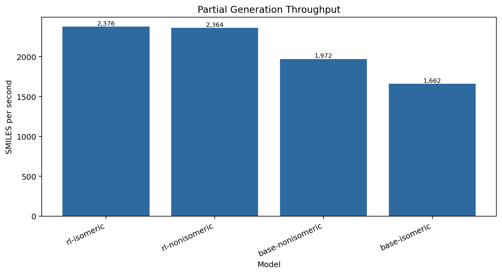
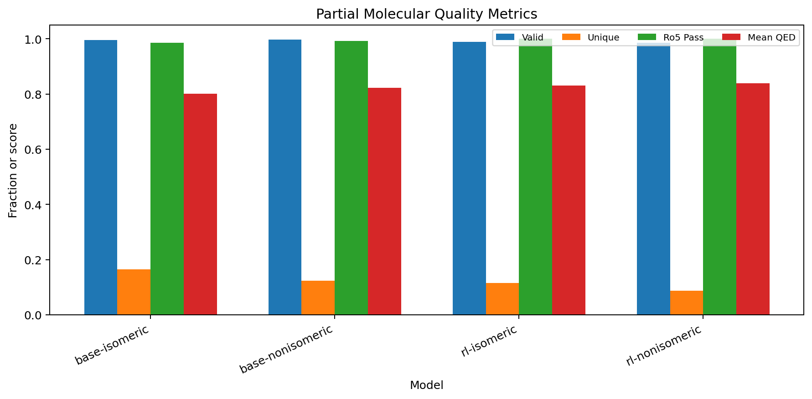
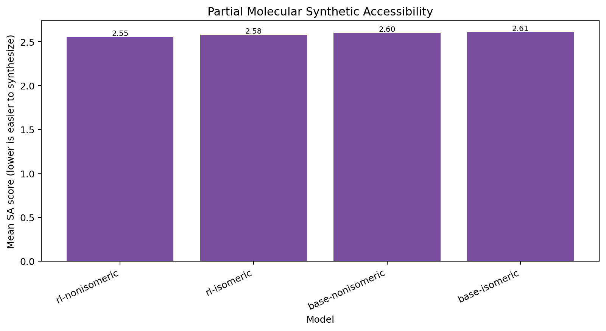
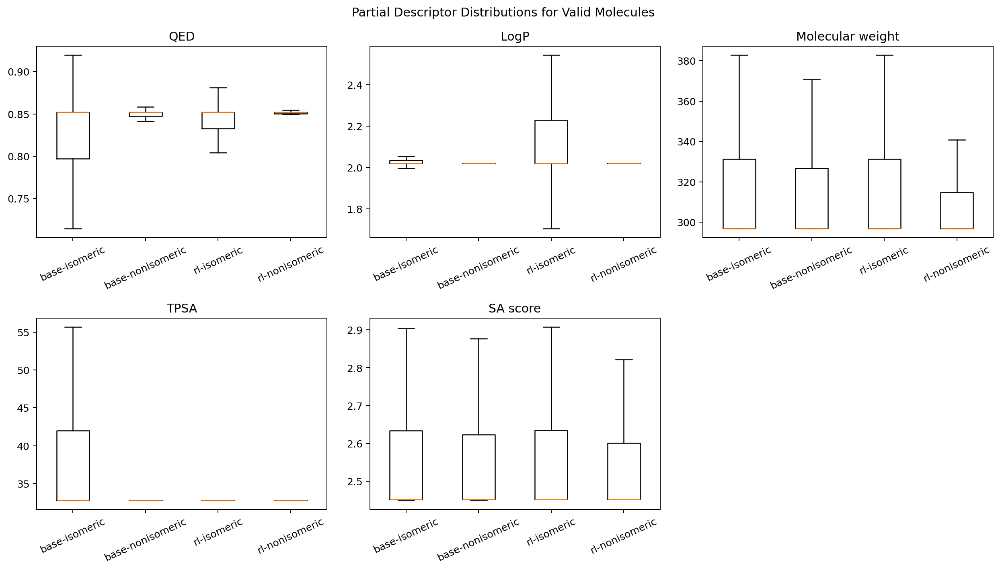

# Benchmarks

Current benchmark outputs:

- [`latest`](latest/) contains the 500k-per-model de novo benchmark.
- [`partial_latest`](partial_latest/) contains the 10k-per-model partial-generation benchmark.

Both runs used Docker image `igen3:blackwell` on an NVIDIA RTX PRO 2000 Blackwell Generation Laptop GPU with 8 GB VRAM, PyTorch `2.11.0+cu128`, Python `3.12.13`, CUDA runtime `12.8`, mounted models at `/models`, `--batch-size auto`, and `--compile off`.

## 500k De Novo Results

Command:

```bash
docker run --rm --gpus all \
  -v "${PWD}/models:/models:ro" \
  -v "${PWD}/benchmarks:/benchmarks" \
  igen3:blackwell benchmark \
  --count 500000 \
  --batch-size auto \
  --compile off \
  --output-dir /benchmarks/latest
```

| Model | Batch | Seconds | SMILES/s | Valid | Unique valid | QED mean | SA mean | Ro5 pass |
| --- | ---: | ---: | ---: | ---: | ---: | ---: | ---: | ---: |
| `base-isomeric` | 4,887 | 331.18 | 1,510 | 0.9778 | 0.9911 | 0.6047 | 3.0693 | 0.8815 |
| `base-nonisomeric` | 5,286 | 229.78 | 2,176 | 0.9795 | 0.9884 | 0.6081 | 3.0764 | 0.8816 |
| `rl-isomeric` | 4,853 | 171.72 | 2,912 | 0.9826 | 0.9794 | 0.8562 | 2.4062 | 0.9996 |
| `rl-nonisomeric` | 5,286 | 159.79 | 3,129 | 0.9827 | 0.9814 | 0.8646 | 2.4314 | 0.9997 |


## 10k Partial Results

Seed preparation:

```bash
docker run --rm \
  -v "${PWD}/benchmarks:/benchmarks" \
  igen3:blackwell randomize-smiles \
  --smiles "N1(C(COC)=O)C(C)CN(CC1)C(c1cc(Cl)ccc1)" \
  --max-variants 10000 \
  --stagnation-limit 5000 \
  --output /benchmarks/partial_latest/seeds/reference_randomized.smi \
  --metadata-output /benchmarks/partial_latest/seeds/reference_randomized.json
```

RDKit found 1,888 unique seed variants after 30,417 randomized attempts and stopped by `stagnation_limit`. The benchmark multiplied those seeds with `samples_per_seed=6` and clipped to 10,000 partial inputs per model.

Command:

```bash
docker run --rm --gpus all \
  -v "${PWD}/models:/models:ro" \
  -v "${PWD}/benchmarks:/benchmarks" \
  igen3:blackwell benchmark-partial \
  --seed-file /benchmarks/partial_latest/seeds/reference_randomized.smi \
  --count 10000 \
  --batch-size auto \
  --compile off \
  --output-dir /benchmarks/partial_latest
```

| Model | Batch | Seconds | SMILES/s | Valid | Unique valid | QED mean | SA mean | Ro5 pass |
| --- | ---: | ---: | ---: | ---: | ---: | ---: | ---: | ---: |
| `base-isomeric` | 4,887 | 6.02 | 1,662 | 0.9964 | 0.1644 | 0.8016 | 2.6067 | 0.9865 |
| `base-nonisomeric` | 5,286 | 5.07 | 1,972 | 0.9978 | 0.1239 | 0.8226 | 2.6009 | 0.9920 |
| `rl-isomeric` | 4,845 | 4.21 | 2,376 | 0.9887 | 0.1149 | 0.8313 | 2.5769 | 1.0000 |
| `rl-nonisomeric` | 5,286 | 4.23 | 2,364 | 0.9859 | 0.0871 | 0.8391 | 2.5534 | 1.0000 |








