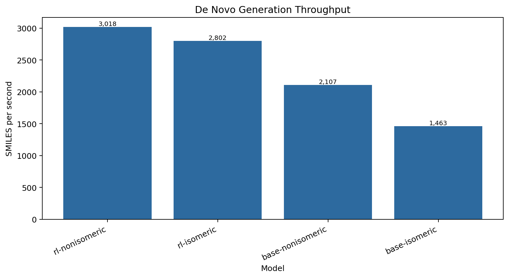
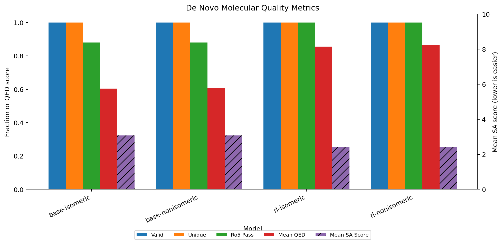
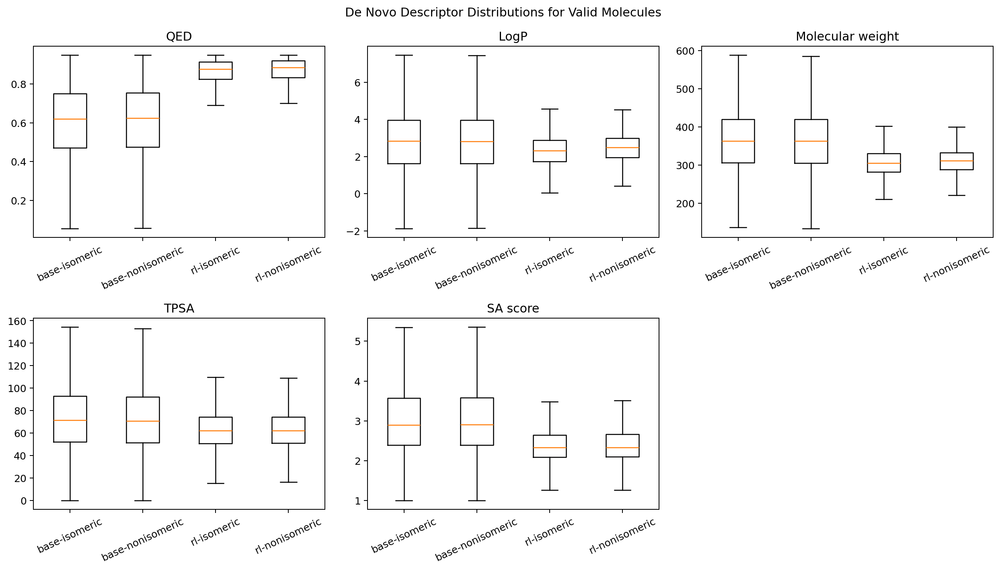
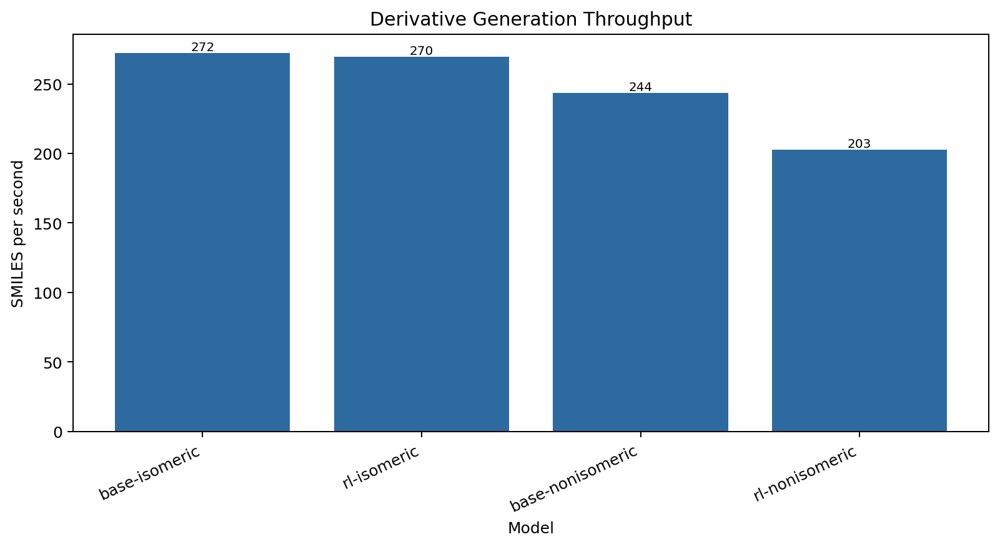
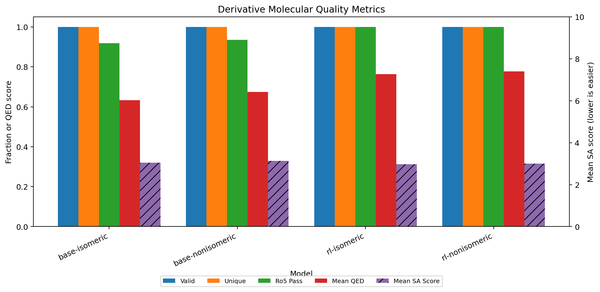
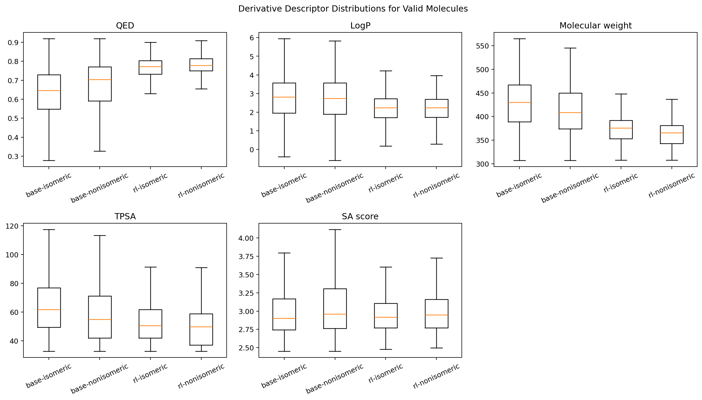

# Benchmarks

Current benchmark outputs:

- [`latest`](latest/) contains the de novo benchmark artifacts.
- [`derivative_latest`](derivative_latest/) contains the derivative-generation benchmark artifacts.

Both runs used Docker image `igen3:blackwell` on an NVIDIA RTX PRO 2000 Blackwell Generation Laptop GPU with 8 GB VRAM, PyTorch `2.11.0+cu128`, Python `3.12.13`, CUDA runtime `12.8`, mounted models at `/models`, `--batch-size auto`, and `--compile off`.

The stored `.smi` files are canonical RDKit-valid unique SMILES. The benchmark summaries retain both candidate counts and final accepted output counts.

## De Novo Results

Command:

```bash
docker run --rm --gpus all \
  -v "${PWD}/models:/models:ro" \
  -v "${PWD}/benchmarks:/benchmarks" \
  igen3:blackwell benchmark \
  --count 500000 \
  --batch-size auto \
  --compile off \
  --output-dir /benchmarks/latest
```

| Model | Candidates | Output | Output SMILES/s | Candidate SMILES/s | QED mean | SA mean | Ro5 pass |
| --- | ---: | ---: | ---: | ---: | ---: | ---: | ---: |
| `base-isomeric` | 500,000 | 484,565 | 1,463 | 1,510 | 0.6045 | 3.0727 | 0.8808 |
| `base-nonisomeric` | 500,000 | 484,057 | 2,107 | 2,176 | 0.6079 | 3.0778 | 0.8808 |
| `rl-isomeric` | 500,000 | 481,140 | 2,802 | 2,912 | 0.8551 | 2.4169 | 0.9996 |
| `rl-nonisomeric` | 500,000 | 482,180 | 3,018 | 3,129 | 0.8636 | 2.4411 | 0.9997 |







## Derivative Results

Seed preparation:

```bash
docker run --rm \
  -v "${PWD}/benchmarks:/benchmarks" \
  igen3:blackwell randomize-smiles \
  --smiles "N1(C(COC)=O)C(C)CN(CC1)C(c1cc(Cl)ccc1)" \
  --max-variants 10000 \
  --stagnation-limit 5000 \
  --output /benchmarks/derivative_latest/seeds/reference_randomized.smi \
  --metadata-output /benchmarks/derivative_latest/seeds/reference_randomized.json
```

RDKit found 1,888 unique seed variants after 30,417 randomized attempts and stopped by `stagnation_limit`. The benchmark multiplied those seeds with `samples_per_seed=6` and clipped to 10,000 candidate inputs per model. Final outputs exclude the seed molecules.

Command:

```bash
docker run --rm --gpus all \
  -v "${PWD}/models:/models:ro" \
  -v "${PWD}/benchmarks:/benchmarks" \
  igen3:blackwell benchmark-derivative \
  --seed-file /benchmarks/derivative_latest/seeds/reference_randomized.smi \
  --count 10000 \
  --batch-size auto \
  --compile off \
  --output-dir /benchmarks/derivative_latest
```

| Model | Candidates | Output | Output SMILES/s | Candidate SMILES/s | QED mean | SA mean | Ro5 pass |
| --- | ---: | ---: | ---: | ---: | ---: | ---: | ---: |
| `base-isomeric` | 10,000 | 1,637 | 272 | 1,662 | 0.6329 | 3.0501 | 0.9188 |
| `base-nonisomeric` | 10,000 | 1,235 | 244 | 1,972 | 0.6744 | 3.1332 | 0.9352 |
| `rl-isomeric` | 10,000 | 1,135 | 270 | 2,376 | 0.7631 | 2.9723 | 1.0000 |
| `rl-nonisomeric` | 10,000 | 858 | 203 | 2,364 | 0.7773 | 3.0010 | 1.0000 |






